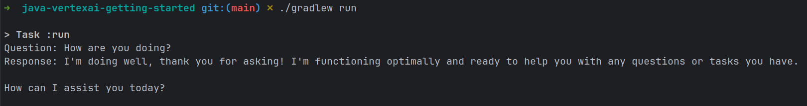

# java-vertexai-getting-started
A simple Java client for interacting with Google Gemini models using the Vertex AI Java SDK.

## Prerequisites
*  Java Development Kit (JDK) 11 or higher
*   Gradle
*   A Google Cloud Project with the Vertex AI API enabled.
*   Authenticated Google Cloud credentials (Application Default Credentials). Run `gcloud auth application-default login`.

## Setup
1. Clone the Repository
2. Configure Project ID and Location by updating the `PROJECT_ID` and `LOCATION` fields in the [Main.java](src/main/java/org/example/Main.java) class.
3. (Optional) Update the model name to match the specific Gemini model you would like to use (Default is Gemini 2.5 Pro Preview).
    * A list of model cards containing the appropriate model name for each Gemini model is available [here](https://cloud.google.com/vertex-ai/generative-ai/docs/model-garden/available-models#google-models).

## Project Structure
```
java-vertexai-getting-started
    ├── build.gradle.kts
    ├── docs
    │   └── images
    │       └── example_output.png
    ├── gradle
    │   └── wrapper
    │       ├── gradle-wrapper.jar
    │       └── gradle-wrapper.properties
    ├── gradlew
    ├── gradlew.bat
    ├── LICENSE
    ├── README.md
    ├── settings.gradle.kts
    └── src
        ├── main
        │   ├── java
        │   │   └── org
        │   │       └── example
        │   │           └── Main.java
        │   └── resources
        └── test
            ├── java
            └── resources
```

## Usage
```./gradelw run```

## Example Output
